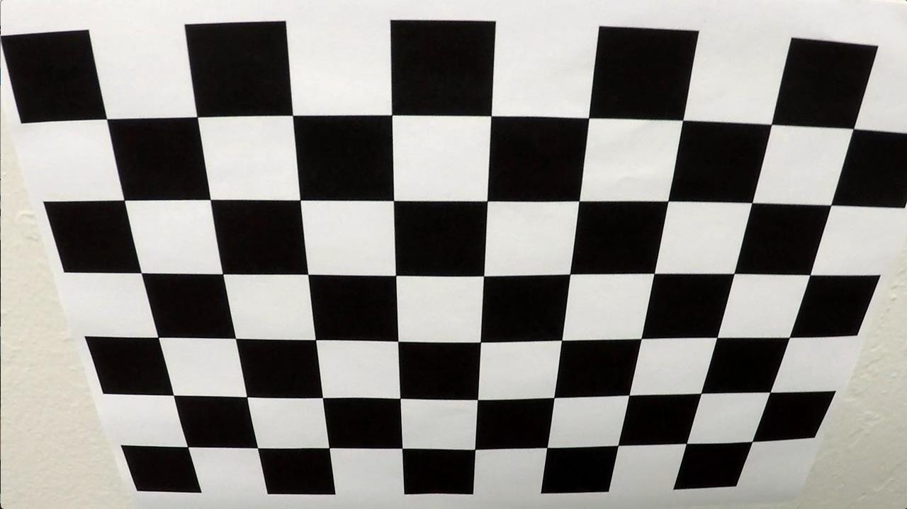
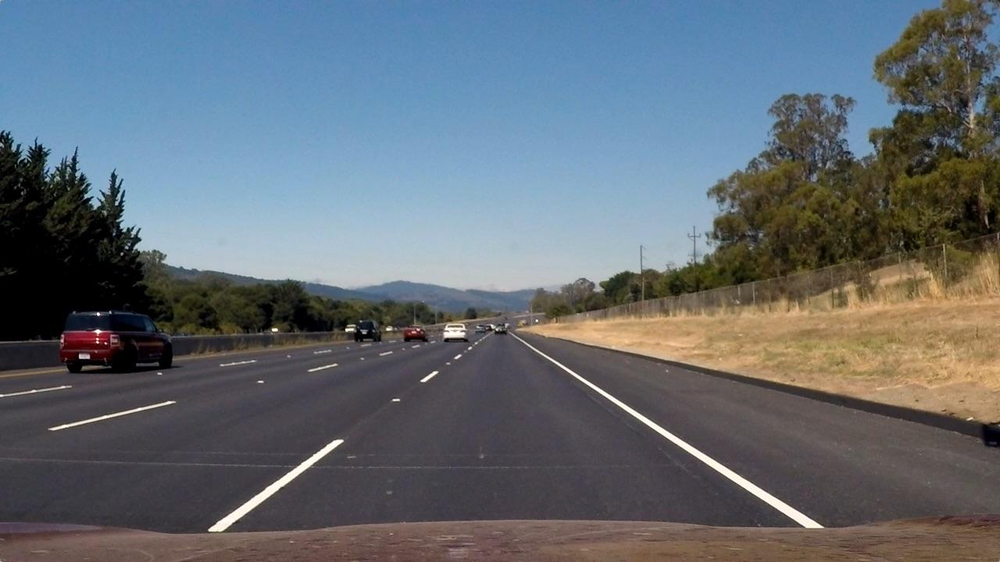
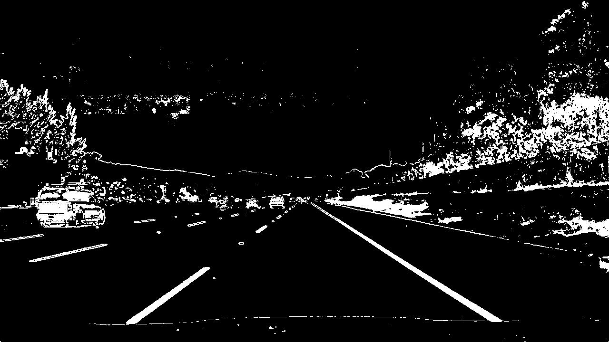
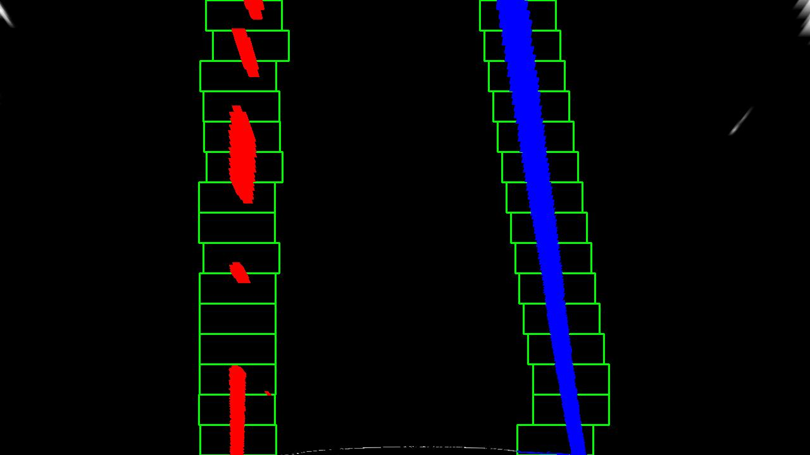
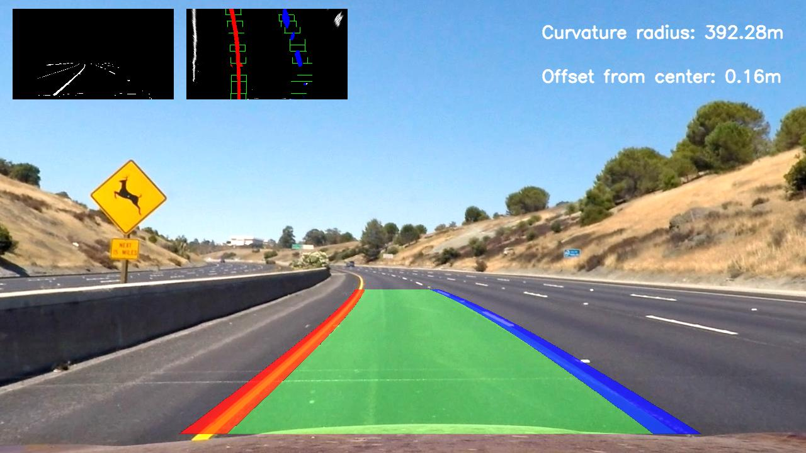

## Advanced Lane Finding
[](http://www.udacity.com/drive)


<p align="center">
 <a href="https://www.youtube.com/watch?v=g5BhDtoheE4"></a>
 <br>Qualitative results. (click for full video)
</p>

---

**Advanced Lane Finding Project**

The goals / steps of this project are the following:

* Compute the camera calibration matrix and distortion coefficients given a set of chessboard images.
* Apply a distortion correction to raw images.
* Use color transforms, gradients, etc., to create a thresholded binary image.
* Apply a perspective transform to rectify binary image ("birds-eye view").
* Detect lane pixels and fit to find the lane boundary.
* Determine the curvature of the lane and vehicle position with respect to center.
* Warp the detected lane boundaries back onto the original image.
* Output visual display of the lane boundaries and numerical estimation of lane curvature and vehicle position.

[//]: # (Image References)

[img_overview]: ./img/overview.gif "Output Overview"


## [Rubric](https://review.udacity.com/#!/rubrics/571/view)

### Camera Calibration

OpenCV provide some really helpful built-in functions for the task on camera calibration. First of all, to detect the calibration pattern in the [calibration images](./camera_cal/), we can use the function `cv2.findChessboardCorners(image, pattern_size)`. 

Once we have stored the correspondeces between 3D world and 2D image points for a bunch of images, we can proceed to actually calibrate the camera through `cv2.calibrateCamera()`. Among other things, this function returns both the *camera matrix* and the *distortion coefficients*, which we can use to undistort the frames.

The code for this steps can be found in [calibration_utils](./calibrate.py).   

I applied this distortion correction to the test image using the `cv2.undistort()` function and obtained the following result (appreciating the effect of calibration is easier on the borders of the image): 

<table style="width:100%">
  <tr>
    <th>
      <p align="center">
           
           <br>Chessboard image before calibration
      </p>
    </th>
    <th>
      <p align="center">
           
           <br>Chessboard image after calibration
      </p>
    </th>
  </tr>
</table>

### Pipeline (single images)

#### 1. Provide an example of a distortion-corrected image.

We may utilize the camera matrix and distortion coefficients we discovered to undistort the test images after the camera has been calibrated. Indeed, if we wish to investigate the road's *geometry*, we must ensure that the images we're working with are free of distortions. On one of the test images, here's the outcome of distortion correction:

<table style="width:100%">
  <tr>
    <th>
      <p align="center">
           
           <br>Test image before calibration
      </p>
    </th>
    <th>
      <p align="center">
           
           <br>Test image after calibration
      </p>
    </th>
  </tr>
</table>

Evaluating the effect is a little more difficult in this situation, but there is a difference on both the left and right sides of the picture.

#### 2. Describe how (and identify where in your code) you used color transforms, gradients or other methods to create a thresholded binary image.  Provide an example of a binary image result.

The first stage in the pipeline that will lead us to recognize the lane is correctly producing the binary image from the input frame. As a result, I believe it is also one of the most crucial. It's quite tough to  get decent outcomes in the pipeline's subsequent phases if the binary image is poor. This section's code may be located [here](./camera utils.py).

To create a binary image, I utilized a mixture of color and gradient thresholds. The S channel of the image's HLS conversion is first thresholded. I used a threshold on the V channel in [HSV](http://docs.opencv.org/3.2.0/df/d9d/tutorial_py_colorspaces.html) color space for the yellow lines. In addition, I convolve the input frame with the Sobel kernel to get an estimate of the line gradients.I've included screenshots of each substep as well as the end result:
<table style="width:100%">
  <tr>
    <th>
      <p align="center">
           
           <br>Test image before Thresholding
      </p>
    </th>
    <th>
      <p align="center">
           
           <br>Test image after Thresholding
      </p>
    </th>
  </tr>
</table>

#### 3. Describe how (and identify where in your code) you performed a perspective transform and provide an example of a transformed image.

We can find the code for warping between the two perspectives [here](./camera utils.py). The method `perspective()`  takes a frame (color or binary) as an argument and returns a bird's-eye view of the scene. We must map four points in the original space and four points in the warped space in order to accomplish perspective warping. Both the source and destination locations are manually hardcoded for this reason.

```

    src = np.float32([[560,460],[180,690],[1130,690],[750,460]])
    
    
    dst = np.float32([[320,0],[320,720],[960,720],[960,0]]) 

```

By sketching the src and dst points onto a test image and its warped counterpart to ensure that the lines looked parallel in the warped picture, I was able to confirm that my perspective transform was functioning as planned.

<p align="center">
  
</p>

#### 4. Describe how (and identify where in your code) you identified lane-line pixels and fit their positions with a polynomial?

There are (at least) two methods for determining which pixels in a binary image correspond to lane-lines. If we have a new frame and have never found the lane-lines, we must do a thorough examination of the frame. This search is accomplished in `utils.fit_polynomial()` fits by sliding windows: we slide two windows towards the top side of the picture, selecting which pixels correspond to which lane-line, beginning from the bottom of the picture, exactly from the peak location of the histogram of the binary image.

On the other hand, if we're processing a video and we've confidently identified lane-lines in the previous frame, we may focus our search on the lane-lines we've already discovered: after all, we're operating at 30 frames per second, so the lines won't be that far apart, right? Line fits by search_previous() implements the second technique. I use a class created in line utils.Line to maintain track of identified lines over subsequent frames, which helps keep the code simpler.

```
class Line():
    def __init__(self, n_window):
        # Number of Frames to keep update
        self.n_window = n_window
        # was the line detected in the last iteration?
        self.detected = False  
        #polynomial coefficients for the most recent fit
        self.current_fit = []
        #radius of curvature of the line in some units
        self.radius_of_curvature = None 
        #distance in meters of vehicle center from the line
        self.line_base_pos = None 
        #difference in fit coefficients between last and new fits
        self.diffs = np.array([0,0,0], dtype='float') 
        #x values for detected line pixels
        self.allx = None  
        #y values for detected line pixels
        self.ally = None  
        # x values of the last n fits of the line
        self.recent_xfitted = [] 
        #average x values of the fitted line over the last n iterations
        self.bestx = np.mean(self.recent_xfitted, axis=0) if len(self.recent_xfitted) !=0 else []    
        #polynomial coefficients averaged over the last n iterations
        self.best_fit = np.mean(self.current_fit, axis=0) if len(self.current_fit) !=0 else []
    
    ... methods ...
```

The actual processing pipeline is implemented in function `process_pipeline()` in [`pipeline.py`](./pipeline.py). As it can be seen, when a detection of lane-lines is available for a previous frame, new lane-lines are searched through `line_utils.get_fits_by_previous_fits()`: otherwise, the more expensive sliding windows search is performed.

The qualitative result of this phase is shown here:

<table style="width:100%">
  <tr>
    <th>
      <p align="center">
           
           <br>Bird's-eye view (binary)
      </p>
    </th>
    <th>
      <p align="center">
           
           <br>Bird's-eye view (lane detected)
      </p>
    </th>
  </tr>
</table>

#### 5. Describe how (and identify where in your code) you calculated the radius of curvature of the lane and the position of the vehicle with respect to center.

Offset from center of the lane is computed in `compute_offset_from_center()` as one of the step of the procecssing pipeline defined in [`main.py`](./main.py). The offset from the lane center can be computed under the hypothesis that the camera is fixed and mounted in the midpoint of the car roof. In this case, we can approximate the car's deviation from the lane center as the distance between the center of the image and the midpoint at the bottom of the image of the two lane-lines detected.  

During the previous lane-line detection phase, a 2nd order polynomial is fitted to each lane-line using `np.polyfit()`. This function returns the 3 coefficients that describe the curve, namely the coefficients of both the 2nd and 1st order terms plus the bias. From this coefficients, following [this](http://www.intmath.com/applications-differentiation/8-radius-curvature.php) equation, we can compute the radius of curvature of the curve. From an implementation standpoint, I decided to move this methods as properties of `Line` class.

```
class Line:
  ... other stuff before ...
    @property
    # average of polynomial coefficients of the last N iterations
    def average_fit(self):
        return np.mean(self.recent_fits_pixel, axis=0)

    @property
    # radius of curvature of the line (averaged)
    def curvature(self):
        y_eval = 0
        coeffs = self.average_fit
        return ((1 + (2 * coeffs[0] * y_eval + coeffs[1]) ** 2) ** 1.5) / np.absolute(2 * coeffs[0])

    @property
    # radius of curvature of the line (averaged)
    def curvature_meter(self):
        y_eval = 0
        coeffs = np.mean(self.recent_fits_meter, axis=0)
        return ((1 + (2 * coeffs[0] * y_eval + coeffs[1]) ** 2) ** 1.5) / np.absolute(2 * coeffs[0])
```

#### 6. Provide an example image of your result plotted back down onto the road such that the lane area is identified clearly.

The whole processing pipeline, which starts from input frame and comprises undistortion, binarization, lane detection and de-warping back onto the original image, is implemented in function `process_pipeline()` in [`main.py`](./main.py).

The qualitative result for one of the given test images follows:

<p align="center">
     
     <br>Qualitative result for test2.jpg
</p>

All other test images can be found in [./output_images/](./output_images/)

###Pipeline (video)

####1. Provide a link to your final video output.  Your pipeline should perform reasonably well on the entire project video (wobbly lines are ok but no catastrophic failures that would cause the car to drive off the road!).

Here's a [link to my video result](https://www.youtube.com/watch?v=g5BhDtoheE4).

---

###Discussion

#### 1. Briefly discuss any problems / issues you faced in your implementation of this project.  Where will your pipeline likely fail?  What could you do to make it more robust?
I find that the more delicate aspect of the pipeline is the first step, namely the binarization of the input frame. Indeed, if that step fails, most of successive steps will lead to poor results. The bad news is that this part is implemented by thresholding the input frame, so we let the correct value of a threshold be our single-point of failure. This is *bad*! Being currently 2017, I think a CNN could be employed to successfully make this step more robust. Some datasets like [Synthia](http://synthia-dataset.net/) should hopefully  provide enough lane marking annotation to train a deep network. I must try this later :-)


